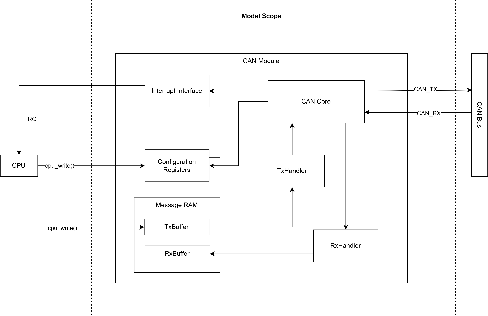

# SystemC Classic CAN Controller Model

A **SystemC Transaction-Level Model (TLM)** of a **Classical CAN Controller**, inspired by the Bosch **M_CAN / STM32 FDCAN** architecture. The model focuses on **functional correctness** and **protocol compliance**, while abstracting away bit timing and physical-layer behavior.

---

### CAN Controller Block Diagram

## Features
1. Node-to-node communication
2. Priority ID-based arbitration
3. Error detection and retransmission
4. Frame types: DATA

## Test Scenario
1. Two CAN Nodes connected through a CAN bus
	- Configure CAN block
	- With given payload, CAN data frame generation and transmission
	- CAN bus arbitration
	- CAN data frame read and retrieve message by another node

# Registers Modeled

| Register | Description | Module |
|----------|-------------|--------|
| `CCCR` | Controller Configuration Register (`INIT`, `CCE`, `FDOE`, `BRSE`) with Bosch write-protection semantics | `config_registers.h` |
| `TXBAR` | Tx Buffer Add Request Register (self-clearing write request) | `tx_handler.h` |
| `TXBRP` | Tx Buffer Request Pending Register | `tx_handler.h` |

## Execution Flow

1. CPU configures the controller registers.
2. CPU writes the message (payload, ID, RTR, DLC) into the Tx Buffer section of Message RAM.
3. CPU writes TXBAR to request transmission.
4. The Tx Handler scans the Tx Buffers, selects the highest-priority pending message, and sends to CAN Core.
5. The Tx Handler retrieves a complete CAN message from Message RAM and forwards it to the CAN Core. 
6. The CAN Core performs CAN protocol processing (SOF, arbitration, CRC, framing, serialization, ACK, EOF) and transmits the frame onto the CAN bus

# Components

| Module | Responsibility |
|---------|----------------|
| `can_types.h` | Shared protocol data structures (`CanDataFrame`, `CanRejectReason`, `RxFilterEntry`) |
| `config_registers.h` | Models CPU-visible configuration registers and controller operating mode |
| `message_ram.h` | Storage for Tx Buffers, Rx FIFO0 and Acceptance Filters. Contains no scheduling or filtering logic. |
| `tx_handler.h` | Owns `TXBAR/TXBRP`, scans pending Tx buffers and selects the highest-priority message (lowest CAN ID). |
| `can_core.h` | Validates the selected frame (controller mode, ID, DLC) and forwards it to the CAN bus. |
| `can_bus.h` | Broadcast communication medium connecting all CAN controller instances. |
| `rx_handler.h` | Performs acceptance filtering and stores accepted frames into Rx FIFO0. |
| `i_protocol_config.h` | Interface exposing controller mode to `CanCore`. |
| `i_tx_message_source.h` | Interface exposing the selected transmit frame to `CanCore`. |

---

## Test Plan
1. Unit Test
	1. Register Test 
	- Read/ Write
	- Access Policy

	2. Controller Test
	- TX Handler to CAN Frame 
	- CAN Frame to RX Handler 

	3. Bus Test
	- Arbitration based on ID

2. Integration Test
- Communication between node1-node2

3. Robustness Tests
- Invalid Register values
- Controller reset during operation

4. Corner Cases
- Same ID from two transmitters
- Empty Payload

5. Protocol Compliance
- Lowest CAN ID wins
- Broadcast reach all nodes
- Payload integrity

---

# Test Cases

| Testbench | Coverage |
|-----------|----------|
| `tb_config_regs.cpp` | Register reset values, write-protection, INIT/CCE behavior |
| `tb_message_ram.cpp` | Tx buffer storage, overwrite, boundary conditions, invalid indices |
| `tb_tx_handler.cpp` | TXBAR/TXBRP behavior, internal arbitration, tie-breaking, rescan, pending requests |
| `tb_can_core.cpp` | Controller mode validation, ID validation, DLC validation, extended IDs, zero-length payload |
| `tb_rx_handler.cpp` | Acceptance filtering, Rx FIFO0 operation, FIFO overflow, FIFO ordering, IDE matching |

---

## Registers Modeled

| Register | Description |
|----------|-------------|
| CCCR | Controller Configuration Register |
| TXBAR | Tx Buffer Add Request Register |
| TXBRP | Tx Buffer Request Pending Register |

---

## Out of Scope

- Bit timing / synchronization
- CRC-15 implementation (placeholder only)
- Error Frames / Overload Frames

